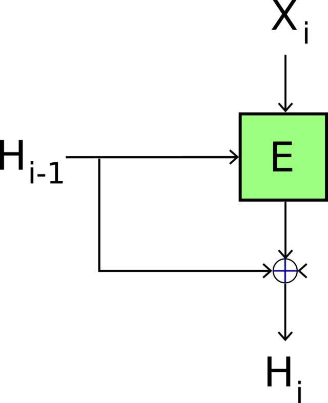

# integrity and authentication

## commitment scheme

When we want to ensure two actors make a decision before seeing the decision of the other actor. Done through commits, where one actor sends a commitment which stores the encrypted decision to the other actor. Then the second actor sends back their decision. Finally, the first actor sends the key for decrypting the commitment to see the decision.

**security:**

1. hiding: no information about the decision can be inferred from the commitment
2. biding: cannot produce a commitment c such that Open(c, k) $\ne$ Open(c, k')

## pseudorandom number generator (PRNG)

**security**: indistinguishable from truly random.

## pseudorandom function (PRF)

**security**: indistinguishable from truly random function (black-box).

PRF is $(q, t, \varepsilon)$-secure if for all bounded $\mathcal A$ $Adv(\mathcal A) = P[b' = 1 | b = 1] - P[b' = 1 | b = 0]$ is negligible. Where $q$ is the amount of queries done with complexity $t$.

## key derivation function (KDF)

**security**: one-way

## hash functions

There is no key that allows to reverse a hash.

- collision resistance
- one-way
- pseudo-randomness

| algorithm | digest             | comment |
| --------- | ------------------ | ------- |
| MD5       | 128                | broken  |
| SHA-1     | 160                | broken  |
| SHA-2     | 224, 265, 384, 512 |         |
| SHA-3     | 224, 265, 384, 512 |         |

### attacks

1. collision attack: find x and x' such that $x \ne x'$ and $h(x) = h(x')$
2. 1st pre-image attack: given y find x such that $y = h(x)$
3. 2nd pre-image attack: given x find x' such that $x \ne x'$ and $h(x) = h(x')$

### encryption to hashing (merkle-damgard scheme)

Treat the message as keys into some encryption function. Encrypt blocks with some seed value. Xor results of individual blocks. Pad the message if needed.

If the encryption function is collision resistant then the resulting hash function is collision resistant.

#### merkle-damgard extension

For padding messages. pad = $|1|0\cdots 0 |\textit{length}|$ where _length_ is a 64-bit number.

### davis-meyer scheme

## MAC (message authentication codes)

Authentication and verification of messages.

**security**: unforgeability

### HMAC

Given a hash function $H$ create a MAC. First key is padded (or truncated) with zeros to the fixed length. Then:

$$
\text{HMAC}_K(X) = H((K \oplus \text{opad}) || H((K \oplus \text{ipad})||X))
$$

Where opad is repeated `0x5c` and ipad is repeated `0x36`.

If compression function is PRF then HMAC is PRF.

### CBCMAC

CBC mode of operation. MAC is the result of the last block of encryption. We use and IV equal to 0.

It is not secure as an attacker can engineer same MAC by appending something to the message. It is secure if the message length is fixed.

#### EMAC

CBCMAC but we additionally encrypt the final output.

#### CMAC

CBCMAC but last block is XORed with $k_{case}$ before encryption. Output is truncated.

#### PMAC

It exists.

### universal hash function

Let $(h_K)_{K \in_U \mathcal K}$ be a family of hash functions from $D$ to $\{0, 1\}^m$ defined by a random key $K$ which is chosen uniformly from a key space $\mathcal K$. This family is $\varepsilon$-XOR-universal if for any $a$ and $x \ne y$ in $D$,

$$
P[h_K(x) \oplus h_K(y) = 1] \le \varepsilon
$$

### WC-MAC

MAC$_{K, K_i}(i, x) = h_K(x) \oplus K_i$ for a $\varepsilon$-XOR-universal hash function and unique $K_i$ (cannot be reused).

### authentication modes

| mode              | comment                |
| ----------------- | ---------------------- |
| CCM               | CTR + CBCMAC           |
| GCM               | CTR + WC-MAC           |
| GCM-SIV           | CTR + WC-MAC           |
| ChaCha20-Poly1305 | stream cipher + WC-MAC |

#### CCM

1. select nonce N
2. T = CBCMAC(message)
3. encrypt T||message in CTR using N

#### GCM

Takes plaintext plus extra data.

### one-wayness

Game:

1. pick x $\in$ D
2. y $\leftarrow$ h(x)
3. $\mathcal A(y) \to x'$
4. return 1$_{h(x') = y}$

### MAC key-recovery

Game:

1. K $\stackrel{\$}{\leftarrow} \{0, 1\}^k$
2. $\mathcal A^{\text{OMac}} \to K'$
3. return 1$_{K = K'}$

Oracle OMac(X):

1. return MAC(K, X)

### MAC forgery

Game:

1. K $\stackrel{\$}{\leftarrow} \{0, 1\}^k$
2. Queried $\leftarrow \emptyset$
3. $\mathcal A^{\text{OMac}} \to (X, t)$
4. if $X \in$ Queried then return 0
5. return 1$_{\text{MAC}(K, X) = t}$

Oracle OMac(X):

1. Queried = Queried $\cup \{X\}$
1. return MAC(K, X)

secure against forgeries $\implies$ secure against key recovery

### MAC distinguisher

$$
Adv = Pr[\Gamma_1 \text{ returns } 1] - Pr[\Gamma_0 \text{ returns } 1]
$$

Game $\Gamma_b$:

1. $K \stackrel{\$}{\leftarrow} \{0, 1\}^k$
2. pick $F : D \to \{0, 1\}^\tau$
3. $\mathcal A^{O} \to z$
4. return $z$

O(X):

1. if b = 0 then return $F(X)$
2. return MAC(K, X)

secure against distinguisher $\implies$ secure against forgeries

## birthday paradox

The probability of picking the same number twice from $\{1, \cdots, N\}$ when picking n times with uniform probability is $p = 1 - \frac{N!}{N^n(N - n)!}$

For $\theta = \frac{n}{\sqrt{N}}$, $p \stackrel{N \to \infty}{\longrightarrow} 1 - e^{-\frac{\theta^2}{2}}$

### collision search

1. for $\theta \sqrt{N}$ times pick x, compute y = h(x). If y is in the hash map, return x and x'. Otherwise insert into hash map.

## rho effect

If we start with x that is outside of a cycle and then continuously hash x, h(x), h(h(x)), etc, we eventually reach enter a cycle. Let $h_t(x)$ be the point where we enter the cycle. If we continue hashing, eventually $h^k(x) = h_t(x)$ where $k \ne l$ (because we are in a cycle and we entered to it from a different side). This means $h^{k-1}(x)$ and $h_{t-1}(x)$ are two different values that hash to the same thing: a collision.
