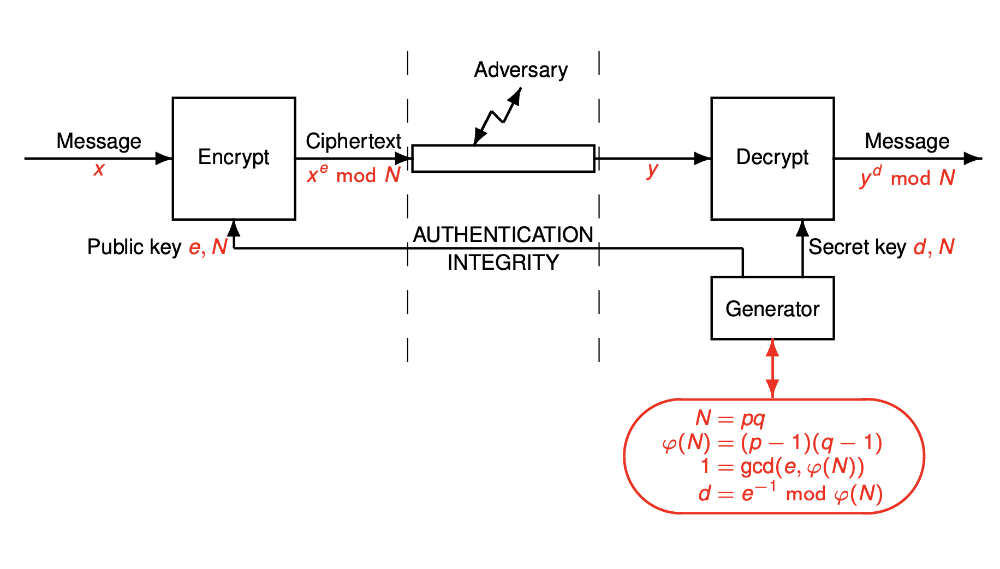

# RSA



## Euler totient function

$\varphi(n)$ is the number of coprimes to $n$.

1. $|Z^*_n| = \varphi(n)$
2. for all $x \in Z_n$ we have $x \in Z_n^* \iff gcd(x, n) = 1$
3. $Z_n$ is a field $\iff Z_n \setminus \{0\} \iff \varphi(n) = n - 1 \iff n$ is prime
4. for all $x \in Z_n^*$ we have $x^{\varphi(n)} \equiv 1 \pmod n$
5. if $e$ such that $gcd(e, \varphi(n)) = 1$ we let $d = e^{-1} \bmod \varphi(n)$. For all $y \in Z_n^*$, $y^d \bmod n$ is the only e'th root of $y$ modulo $n$

- $\varphi(p) = p - 1$ when $p$ is prime
- $\varphi(mn) = \varphi(m)\varphi(n)$ when $m$ and $n$ are coprime
- $\varphi(p^a) = (p - 1)p^{a-1}$ when $p$ is prime
- $\varphi(p_1^{a_1}, \cdots, p_r^{a_r}) = (p_1 - 1)p_1^{a_1-1} \cdot \ldots \cdot (p_r - 1)p_r^{a_r-1}$

## chinese remainder theorem (CRT)

Let $m$ and $n$ be two integers such that $gcd(m, n) = 1$. For any $a, b \in \Z$ there exists $x \in \Z$ such that

$$
x \equiv a \pmod m
$$

$$
x \equiv b \pmod n
$$

For all such solutions, $x \bmod (mn)$ is unique.

$f: Z_{mn} \to Z_m \times Z_n$ is a group isomorphism $f(x) = (x \bmod m, x \bmod n)$. Then $f^{-1}(a, b) = an(n^{-1} \bmod m) + bm(m^{-1} \bmod n) \pmod{mn}$

### equality modulo composite numbers

For any $a, b, m, n \in \Z$ such that $gcd(m, n) = 1$ then

$$
\begin{cases}
	a \equiv b \pmod m \\
	a \equiv b \pmod n \\
\end{cases} \iff a \equiv b \pmod{mn}
$$

### CRT backwards

Let $m, n$ be two integers such that $gcd(m, n) = 1$. Let $u = n(n^{-1} \bmod m)$ and $v = m(m^{-1} \bmod n)$ then $g: (a, b) \mapsto au + bv \bmod{mn}$ is a ring isomorphism.

## trial division

Given an integer we output a list of primes whose product is equal to n.

```
i = 2
x = n
for _ in 2:sqrt(n)
	while i divides x
		output i
		x = x / i
	i = i + 1

if x > 1
	output x
```

## fermat test

Utilizing the little fermat theorem. Might call something a prime that isn't a prime.

```
for _ in 1:k
	b = random(1, n)
	x = b^(n-1) mod n
	if x != 1
		return "not prime"

return "maybe prime"
```

## carmichael numbers

$n$ is a carmichael number iff it is composite and $\forall_{\{a : gcd(a, n) = 1\}} a^{n-1} \equiv 1 \pmod n$

## miller-rabin test

We can write $n - 1$ as $2^st$ for t odd. When $n$ is prime then $b^{n-1} \bmod n = ((b^t)^2\cdots)^2 \bmod n = 1$

```
if n = 2
	return "prime"

if n is even
	return "composite"

n === 2^s * t + 1

for _ in 1:k
	b = random(1, n)
	x = b^t mod n
	i = 0
	if x != 1
		while x != n - 1
			x = x^2 mod n
			i = i + 1
			if i == s or x == 1
				return "composite"

return "maybe prime"
```

Complexity: $O(k\ell^3)$

An integer is prime iff it passes the miller-rabin test for all $b \in Z_n^*$. If more than a quarter of $b \in Z_n^*$ pass the miller-rabin then all $b \in Z_n^*$ do.

So $P[\text{output maybe prime}|\text{n composite}] \le 4^{-k}$.

## prime number generation

Let $p(N)$ denote the number of prime numbers up till $N$. Then $p(N) \sim \frac{N}{\ln N}$. So the chance of a $\ell$ bit number to be prime is $\frac{1}{\ell \ln 2}$. We then apply miller-rabin test to check if the number is prime. If not, try again. Complexity: $O(\ell^4)$.

If we let $k = \frac{1}{2}(\log_2\ell - \log_2\varepsilon)$ then $P[\text{output is not prime}] \le O(\ell) \cdot 4^{-k} = O(\varepsilon)$

## RSA cryptosystem

- Public parameter: $\ell$
- find two random different prime numbers $p$ and $q$ of size $\frac{\ell}{2}$ bits. Set $N = pq$. Select $e$ such that $gcd(e, (p - 1)(q - 1)) = 1$
  - pick $e$ random until it is valid
  - popular choice are $e = 17$ and $e = 2^{16} + 1$. They are prime (so likely to be coprime with (p-1)(q-1)) and have a simple bit representation for raising power when encrypting
- an element $x \in Z_N$
- $pk = (e, N)$
- $sk = (d, N)$ where $d = e^{-1} \bmod \varphi(N)$
- $y = x^e \bmod N$
- $x = y^d \bmod N$

For any $x \in \{0, \cdots, N-1\}$ and any $k$ we have $x^{k \varphi(N)+1} \bmod N = x$

### complexities

RSA with modulus of $\ell$ bits:

- Generation: $O(\ell^4)$
- Encryption: $O(\ell^3)$ (or $O(\ell^2)$ if $e$ is constant)
- Decryption: $O(\ell^3)$

## quadratic residuosity

### square roots in finite fields

Let $K$ be a finite field. For any $x \in K$ we have $x^2 = 1 \implies x = 1 \lor x = -1$.

### existence

Let $p$ be an odd prime number. Then $b \in Z_p^*$ has a square root if and only if $b^{\frac{p-1}{2}} \bmod p = 1$. Then $b$ is called a quadratic residue.

### $Z_p$ when $p \equiv 3 \pmod 4$

Let $p$ be a prime number such that $p \equiv 3 \pmod 4$. For any $x \in Z_p$ we have $y^2 \equiv x \pmod p \implies y \equiv x^{\frac{p+1}{4}} \pmod p \lor y \equiv -x^{\frac{p+1}{4}} \pmod p$.

### $Z_n$ when $n = pq$

let $p$ and $q$ be two different prime numbers and $n = pq$. Let $x \in Z_n$ and $a$ and $b$ such that

$$
\begin{aligned}
x \equiv a^2 \pmod p \\
x \equiv b^2 \pmod q \\
\end{aligned}
$$

We have

$$
x \equiv y^2 \pmod n \iff \begin{cases}
	y \equiv \pm a \pmod p \\
	y \equiv \pm b \pmod q \\
\end{cases}
$$

### legendre symbol

For $p$ an odd prime

$$
\left(\frac{b}{p}\right) = \begin{cases}
	0 & \text{if } b \bmod p = 0 \\
	1 & \text{if b is a quadratic residue in } Z_p^* \\
	-1 & \text{if b is not a quadratic residue in } Z_p^* \\
\end{cases}
$$

### jacobi symbol

For $n$ odd

$$
\left(\frac{b}{n}\right) = \left(\frac{b}{p_1}\right)^{\alpha_1} \cdot \ldots \cdot \left(\frac{b}{p_r}\right)^{\alpha_r}
$$

For the factorization of $n$.

So $b \in Z_p^*$ is a quadratic residue $\iff \left(\frac{b}{p}\right) = 1$. So $b \in Z_n^*$ is a quadratic residue $\implies \left(\frac{b}{n}\right) = 1$.

Properties:

- $\left(\frac{1}{b}\right) = 1$ for $b$ odd
- $\left(\frac{a}{b}\right) = \left(\frac{a \bmod b}{b}\right)$ for $b$ odd
- $\left(\frac{ab}{c}\right) = \left(\frac{a}{c}\right)\left(\frac{b}{c}\right)$ for $c$ odd
- $\left(\frac{2}{a}\right) = 1$ if $a \equiv \pm 1 \pmod 8$ and $\left(\frac{2}{a}\right) = -1$ if $a \equiv \pm 3 \pmod 8$ for $a$ odd
- $\left(\frac{a}{b}\right) = -\left(\frac{b}{a}\right)$ if $a \equiv b \equiv 3 \pmod 4$ and $\left(\frac{a}{b}\right) = \left(\frac{b}{a}\right)$ otherwise for $a$ and $b$ odd

Algorithm to compute is in $O(\ell^2)$

### the group of quadratic residues (QR)

Let $QR_n$ be the subgroup of $Z_n^*$ of all quadratic residues.

- $x \in QR_n \implies \left(\frac{x}{n}\right) = 1$
- $x, y \in QR_n \implies xy \in QR_n$
- $x \in QR_n, y \in Z_n^* \setminus QR_n \implies xy \in Z_n^* \setminus QR_n$
- for $p$ prime $x, y \in Z_p^* \setminus QR_p \implies xy \in QR_p$

## factoring problem

1. Gen($1^\lambda$) $\to n$
2. $\mathcal A(n) \to (p, q)$
3. return$_{p\cdot q = n \land p, q \in \{2, \cdots, n-1\}}$

### RSA factoring / RSA square roots

1. RSA-Gen($1^\lambda$) $\to n$
2. $\mathcal A(n) \to (p, q)$
3. return$_{p\cdot q = n \land p, q \in \{2, \cdots, n-1\}}$

$$
\iff
$$

1. RSA-Gen($1^\lambda$) $\to n$
2. pick $x \in QR_n$
3. $\mathcal A(n, x) \to y$
4. return$_{y^2 \bmod n = x}$

### lemma

$y_0, y_1 \in Z_n$

$$
\begin{cases}
	y_0^2 &\equiv y_1^2 \pmod n \\
	y_0 &\not\equiv y_1 \pmod n \\
	y_0 &\not\equiv -y_1 \pmod n \\
\end{cases} \implies gcd(y_0 - y_1, n) \notin \{1, n\}
$$

## RSA problems

Note: $\lambda(n)$ is the exponent of the group $Z_n^*$.

RSA-Full $\lambda$-factoring $\implies$ RSA-Computing order in $Z_n^*$ $\implies$ RSA-Computing $\lambda(n)$ $\iff$ RSA-Factoring.

$$
\begin{gather*}
	\text{RSADP} \impliedby &\text{RSAKRP}& \impliedby &\text{GOP}&   \\
													&\Downarrow&              &\Updownarrow&  \\
								          &\text{EMP}&     \implies  &\text{RSAFP}& \\
\end{gather*}
$$

1. RSADP - decryption problem. Given $n, e, y$ find $x$
2. RSAKRP - key recovery problem. Given $n, e$ find $d$
3. GOP - group order problem. Given $n$ find $\varphi(n)$
4. EMP - exponent multiple problem. Given $n$ find a multiple of $\lambda(n)$
5. RSAFP - factorization problem. Given $n$ find $p$ and $q$
