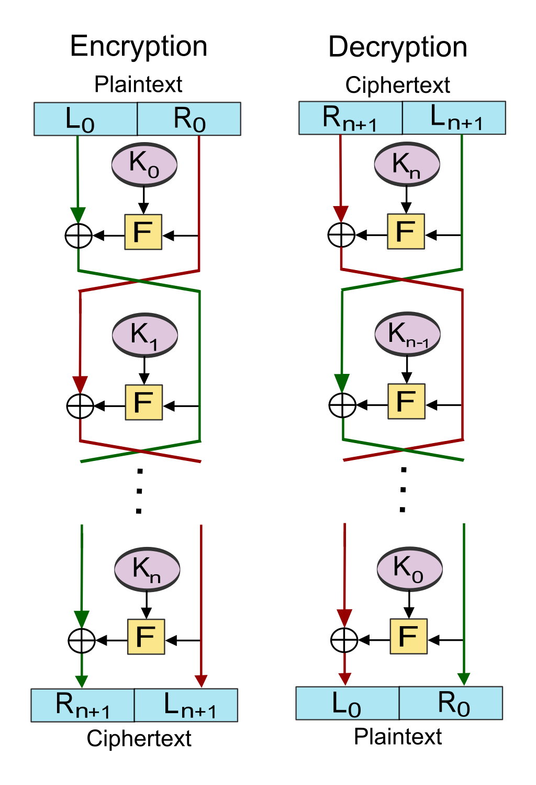

# symmetric encryption

## cryptographic primitive

1. components (alice, bob, key generator, encrypt, decrypt)
2. functionality (correctness)
3. security (confidentiality is preserved, perfect secrecy)

### security notions

Adversary objective: learn confidential information. Typically it is key recovery.

- **ciphertext only attack**: using ciphertexts in transit only.
- **known plaintext attack**: same + known (or guess) the corresponding plaintexts
- **chosen plaintext attack**: force the sender to encrypt some messages selected by the adversary
- **chosen ciphertext attack**: force the receiver to decrypt some messages selected by the adversary

## block ciphers

### data encryption standard (DES)

Encrypts blocks of 64 bits. Key of length 64 bits, but 8 bits are parity bits. We use key schedule to get 16 rounds of 48 bit keys from the main key. We split the plaintext block into two 32 bit parts. We apply the Feistel scheme.

Susceptible to exhaustive search due to small key. There exist keys which produce very weak ciphers.

#### Feistel scheme

$\Psi(F^{K_1}, \cdots, F^{K_k}) = \Psi^{-1}(F^{K_k}, \cdots, F^{K_1})$

- uses a function over $\{0, 1\}^{\frac{n}{2}}$ to be a function transforming into permutations over $\{0, 1\}^n$
- inverse permutations have same structure
- alternate round functions and halve swaps
- final halve swap omitted

### advanced encryption standard (AES)

Encrypts blocks of 128 bits. Uses key of length 128, 192, or 256.

- transform the block to a $4 \times 4$ matrix of bytes
- number of rounds 10, 12, or 14 depending on key length
- non-terminal round:
  - **SubBytes**: map each byte in matrix through a table
  - **ShiftRows**: shift rows by 0, 1, 2, 3 cells to the left (wrapping)
  - **MixColumns**: each column $c$ we replace with $Mc$ ($M$ defined below)
  - **AddRoundKey**: cell-wise XOR between round key
- last round skips **MixColumns**

$$
M = \begin{pmatrix}
	0x02 & 0x03 & 0x01 & 0x01 \\
	0x01 & 0x02 & 0x03 & 0x01 \\
	0x01 & 0x01 & 0x02 & 0x03 \\
	0x03 & 0x01 & 0x01 & 0x02 \\
\end{pmatrix}
$$

All operations are invertible. We however also need the inverse of $M$:

$$
M^{-1} = \begin{pmatrix}
	0x0e & 0x0b & 0x0d & 0x09 \\
	0x09 & 0x0e & 0x0b & 0x0d \\
	0x0d & 0x09 & 0x0e & 0x0b \\
	0x0b & 0x0d & 0x09 & 0x0e \\
\end{pmatrix}
$$

Arithmetics happens in $GF(2^8)$. We reduce everything modulo 2 and modulo $x^8 + x^4 + x^3 + x + 1$.

#### ECB mode

Encrypt each block of a larger plaintext independently with the same key. Can leak information on repeating blocks.

#### CCB mode

Start with an initialization vector (IV). We XOR it with first block and cipher it. Then, the result is XORed with the next block and then encrypted, this continues. So instead of just encrypting the block, we first mix the block with the cipher text from the previous block.

Three ways to handle IV:

1. use a non-secret constant IV (bad idea)
2. use secret IV which is part of the key (ok if not reused)
3. random IV that is sent in clear together with ciphertext

#### OFB mode

TODO
