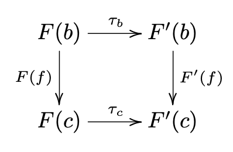

# categories

A category $C$ is a directed graph $(C_0, C_1)$ (objects and morphisms) equipped with composition maps

$$
\gamma_{a,b,c} : C(a, b) \times C(b, c) \to C(a, c) : (f, g) \mapsto g \circ f
$$

For $\forall_{a, b, c} \in C_0$ satisfying the following axioms:

1. **existence of identities** - there is a map $\text{Id} : C_0 \to C_1 : c \mapsto \text{Id}_c$ such that $\text{Id}_c \in C(c, c)$ and $f \circ \text{Id}_a = f = \text{Id}_b \circ f$ $\forall_{f \in C_1(a, b)} \forall_{a, b \in C_0}$
2. **associativity** - for any $a, b, c, d \in C_0$ and $f \in C(a, b)$, $g \in C(b, c)$, and $h \in C(c, d)$ it holds that $(h \circ g) \circ f = h \circ (g \circ f) \in C(a, d)$

## directed graph (quiver)

A directed graph $G$ consists of a pair of classes $G_0$ (vertices) and $G_1$ (edges) equipped with two maps $\text{dom} : G_1 \to G_0$ and $\text{cod} : G_1 \to G_0$.

So for a directed graph $x \stackrel{f}{\longrightarrow} y$, $\text{dom}(f) = x$ and $\text{cod}(f) = y$

### subgraph

A subgraph $G'$ of a directed graph $G$ consists of a pair of subclasses $G'_0 \subseteq G_0$ and $G'_1 \subseteq G_1$ such that $\text{dom}[G_1'] \cup \text{cod}[G'_1] \subseteq G_0'$

## small category

When objects and morphisms are sets then the category is called small.

## subcategory

A subcategory $C'$ of a category $C$ consists of a subgraph $(C_0', C_1')$ that is closed under composition of morphisms and such that $\text{Id}_c \in C_1'$ for all $c \in C_0'$. It is _full_ if $C'(a, b) = C(a, b)$ for all $a, b \in C_0'$ and is _wide_ if $C'_0 = \text{Ob}~C$

## examples

1. $\textsf{Set}$ - objects are all sets and morphisms are all set maps
2. $\textsf{Top}$ - objects are all topological spaces and morphisms are all continues maps
   1. $\textsf{Top}_\star$ - objects are all based topological spaces and morphisms are all based continues maps
3. $\textsf{Gr}$ - objects are all groups and morphisms are all group homomorphisms
4. $\textsf{Ab}$ - objects are all abelian groups and morphisms are all group homomorphisms with abelian domain and codomain
5. $\textsf{Ch}_{\mathbb{k}}$ - where $\mathbb{k}$ is a commutative ring, objects are all chain complexes of $\mathbb{k}$-modules and morphisms are all $\mathbb{k}$-linear chain maps
6. $\textsf{Cat}$ - objects are all small categories and morphisms are all functors of between small categories

## products

Given two categories $C$ and $D$, their product is a category $C \times D$ and specified by

$$
\text{Ob}(C \times D) = \text{Ob}~C \times \text{Ob}~D
$$

and

$$
\forall_{c, c' \in \text{Ob}~C}\forall_{d, d' \in \text{Ob}~D} (C \times D)((c, d), (c', d')) = C(c, c') \times D(d, d')
$$

Then $\text{Id}_{(c, d)} = (\text{Id}_c, \text{Id}_d)$

## category of morphisms

Given a category $C$ we define a category of morphisms $C^\to$ where $\text{Ob}~C^\to = \text{Mor}~C$ and where for every couple $f : a \to b$, $g : c \to d$ of morphisms of $C$,

$$
C^\to(f, g) = \{(h : a \to c, k : b \to d) \in \text{Mor}~C \times \text{Mor}~C | g \circ h = k \circ f : a \to d\}
$$

## opposite category

For a category $C$ its opposite category $C^{op}$ is $\text{Ob}~C^{op} = \text{Ob}~C$ and $C^{op}(a, b) = C(b, a)$

## isomorphism

Given a morphism $f : a \to b$ in C is an _isomorphism_, denoted $\stackrel{\simeq}{\to}$ if it admits an inverse, ie there is a morphism $g : b \to a$ such that $g \circ f = \text{Id}_a$ and $f \circ g = \text{Id}_b$. $a$ and $b$ are called isomorphic.

## functors

A morphism between categories. A functor $F: C \to D$ is a pair of maps $F_{\text{Ob}} : \text{Ob}~C \to \text{Ob}~D$ and $F_{\text{Mor}} : \text{Mor}~C \to \text{Mor}~D$ such that:

$$
F_{\text{Mor}}(f) : F_{\text{Ob}}(a) \to F_{\text{Ob}}(b)
$$

where

$$
F_{\text{Mor}}(\text{Id}_c) = \text{Id}_{F_{\text{Ob}(c)}}
$$

and

$$
F_{\text{Mor}}(g \circ f) = F_{\text{Mor}}(g) \circ F_{\text{Mor}}(f)
$$

Functors are composable in an associative manner

## natural transformations

Let $F, F' : C \to D$ be functors. A natural transformation $\tau : F \to F'$ consists of a map

$$
\tau : \text{Ob}~C \to \text{Mor}~D : c \mapsto \tau_c
$$

such that for all $c \in \text{Ob}~C$

$$
\tau_c \in D(F(c), F'(c))
$$

and all morphisms $f : b \to c$ in $C$, the diagram commutes

---

No more notes will appear. I dropped the course due to lack of prerequisite knowledge.
